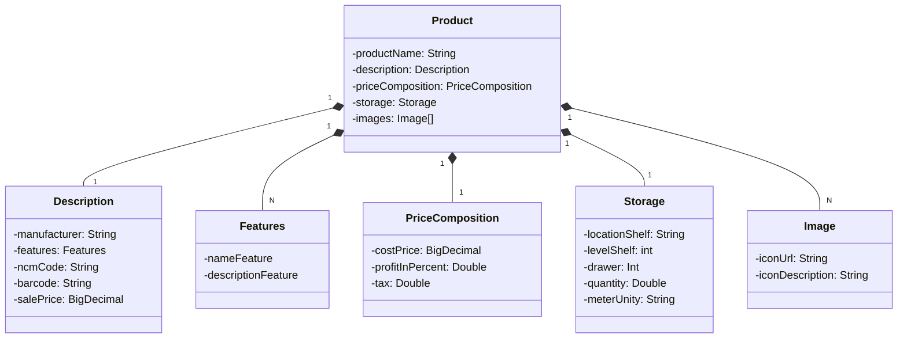

# Último desafio Bootcamp Santander

Esta Java RESTful API criada com o domínio de produtos em estoque.

## Técnologias Utilizadas:
### Java 17
### Spring Boot 3
### Spring Data JPA
### H2 Database
### OpenAPI (Swagger)
### Railway
### Postgres

## Dagrama de classes:

## IMPORTANTE

Este projeto foi construído com um viés totalmente educacional para a DIO.

Adicionei alguns tratamentos de exceções e uma classe que faz o cálculo do preço de custo.