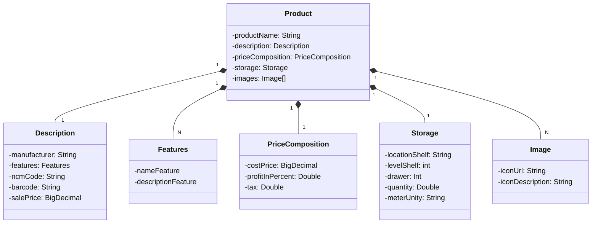

# desafio-dio-santander-last
Estoque
## Dagrama de classes:

```mermaid
classDiagram
    class Product {
        -productName: String
        -description: Description
        -priceComposition: PriceComposition
        -storage: Storage
        -images: Image[]
    }

    class Description {
        -manufacturer: String
        -features: Features
        -ncmCode: String
        -barcode: String
        -salePrice: BigDecimal
    }

    class Features {
        -nameFeature
        -descriptionFeature
    }
    class PriceComposition {
        -costPrice: BigDecimal
        -profitInPercent: Double
        -tax: Double
    }

    class Storage {
        -locationShelf: String
        -levelShelf: int
        -drawer: Int
        -quantity: Double
        -meterUnity: String
    }

    class Image {
        -iconUrl: String
        -iconDescription: String
    }

    Product "1" *-- "1" Description
    Product "1" *-- "N" Features
    Product "1" *-- "1" PriceComposition
    Product "1" *-- "1" Storage
    Product "1" *-- "N" Image
```
